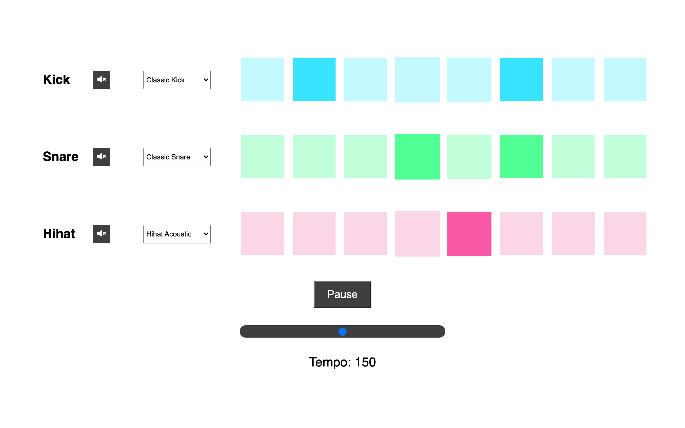

# JS OOP Beat Maker

This is a project using JavaScript object-oriented programing methods to create a drumkit beatmaker.

## Table of contents

- [Overview](#overview)
- [The challenge](#the-challenge)
- [Screenshot](#screenshot)
- [Links](#links)
- [My process](#my-process)
- [Built with](#built-with)
- [What I learned](#what-i-learned)
- [Continued development](#continued-development)
- [Useful resources](#useful-resources)
- [Author](#author)

## Overview

### The challenge

The user should be able to:

- Create beat patterns when clicking on pads in the individual beat tracks.
- Select audio style of beat track from drop down list.
- Play and pause beat audio when clicking the play button.
- Mute audio on individual beat tracks.
- Update beat tempo with the slider.

### Screenshot

### Links

- GitHub URL: [https://github.com/brianlfarmerllc/JsOOP_beat_maker](https://github.com/brianlfarmerllc/JsOOP_beat_maker)
- Live Site URL: [https://dazzling-khorana-f65407.netlify.app/](https://dazzling-khorana-f65407.netlify.app/)

## My process

### Built with

- Semantic HTML5 markup
- CSS3
- JavaScript
- Object oriented programming concepts

### What I learned

I wanted to complete a project using object-oriented programing concepts with ES6 classes. It was good practice even though only one object instance was created in the project. But you must walk before you can run. The main goal was to look at something I would normally do with functional programing methods and instead use OOP concepts.

### Continued development

This is as far as I will take this project, but my next goal is to build an application with multiple object instances.

### Useful resources

- [JavaScript OOP MDN Reference](https://developer.mozilla.org/en-US/docs/Learn/JavaScript/Objects/Object-oriented_JS) - Object-oriented JavaScript for beginners was a good place to start for reference.
- [ES5 vs ES6 OOP](https://www.toptal.com/javascript/es6-class-chaos-keeps-js-developer-up) - I did not get into extending classes or really diving much into the benefits of using the ES6 other than the simplicity of attaching methods but it was a good article that I will probably reference again.

## Author

- Website - [Brian Farmer](https://brianfarmerwebdev.netlify.app)
- GitHub URL: - [GitHub URL](https://github.com/brianlfarmerllc)
